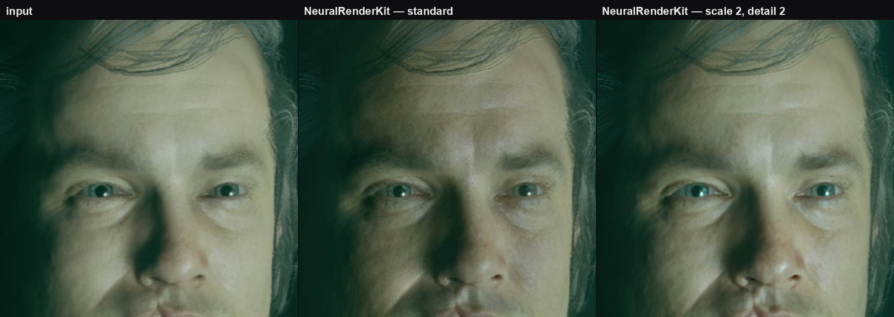
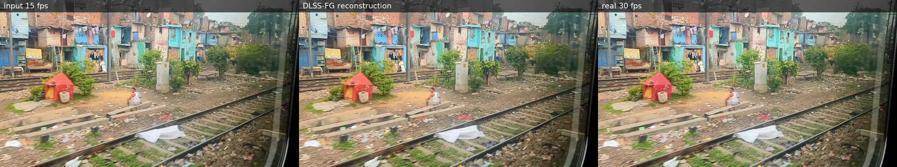

# NeuralRenderKit

Neural rendering runtime with a recovered 71-block transformer graph: Swift
package and `nrk` CLI for Apple Silicon (MLX/Metal and Core ML), plus a
cross-platform Python package (PyTorch inference and weight tooling).
The weights come from your own copy of NVIDIA's `nvngx_dlssnr.dll`; nothing
proprietary is included, downloaded or redistributed.

NeuralRenderKit is independent software. It is not affiliated with, endorsed
by, or a drop-in implementation of NVIDIA DLSS or any other proprietary product.



A native game render at 1408x1600, cropped 1:1 so the pixels are the real ones.
Left is the input, middle is the recovered network at its defaults, right is
`--processing-scale 2 --detail-strength 2`.

## Quick start: from the DLL to an enhanced image

1. Take `nvngx_dlssnr.dll` from your NVIDIA driver or Streamline package
   (the supported checkpoint is file version `310.8.0.0`, SHA-256
   `ceb6432f…2650`) and put it in a folder of your choice, for example
   `weights/`.
2. Install the Python package (Python 3.10+, macOS, Linux or Windows) and
   convert the weights:

   ```sh
   python -m pip install ./python
   nrk-weights all weights/nvngx_dlssnr.dll weights/ --coreml 320x320
   ```

   This writes `weights/dlssnr-weights-logical.safetensors` (PyTorch),
   `weights/NeuralRendering.nrkmodel` (Swift/MLX) and, per `--coreml WxH`,
   `weights/NeuralRendering-WxH-float16.mlpackage` (Core ML; needs
   `pip install './python[coreml]'`, macOS or Linux). `nrk-weights sha256 FILE`
   tells whether a DLL is a known checkpoint; `nrk-weights inspect PACKED`
   lists what an unknown DLL version contains.
3. Run inference.

   PyTorch, any OS (`--device auto|cpu|cuda|mps`, `--precision reference|fast`):

   ```sh
   nrk-torch run --weights weights/dlssnr-weights-logical.safetensors \
     --input portrait.png --output portrait-enhanced.png
   ```

   Metal on Apple Silicon (macOS 14+, Xcode with Swift 6.2, CMake and Ninja):

   ```sh
   swift build -c release && scripts/prepare-mlx-metallib.sh "$(swift build -c release --show-bin-path)"
   .build/release/nrk render-image portrait.png weights/NeuralRendering.nrkmodel \
     --output portrait-enhanced.png --execution metal-fused --precision float16
   ```

   Core ML (fixed network extent: a `256×256` image runs on the `320×320`
   package, `1080p` needs `1920×1088`):

   ```sh
   .build/release/nrk render-image portrait.png weights/NeuralRendering-320x320-float16.mlpackage \
     --output portrait-enhanced.png --backend coreml --compute-units cpu-gpu
   ```

Raw float32 NHWC tensors go through `nrk run MODEL --input in.f32 --input-format rgb-first-frame --width W --height H --output out.f32`
and `nrk-torch run --input in.f32 --width W --height H`.

## Controls

| option (`nrk run` / `nrk-torch run`) | default | effect |
| --- | --- | --- |
| `--profile standard\|natural\|cinematic\|neutral` | `standard` | style index and local tone/structure preset |
| `--processing-scale 1–4` | `1` | run the network on the frame resampled by this factor |
| `--detail-strength 0–8`, `--colour-strength 0–4`, `--detail-radius` | `1`, `1`, `4` | `result = input + colour·lowpass(change) + detail·highpass(change)`; `--processing-scale 2 --detail-strength 2` is the photoreal recipe |
| `--intensity 0–1` | `1` | blend of the enhanced result over the input |
| `--control-mask rgb.f32` | none | red: blend, green: tone, blue: structure per pixel |
| `--noise-frame-index` | `0` | deterministic noise seed; `NeuralRenderingSession` advances it per frame |

## Video

`nrk-video` converts a whole file through FFmpeg: it decodes to raw RGB, runs
every frame through the pipeline and encodes with arguments you control,
copying the source audio. `--temporal` switches on the recovered temporal
path: the previous output is reprojected with motion vectors (OpenCV DIS
optical flow by default, `pip install './python[video]'`) into the network
input and the head's learned blend mixes it with the new prediction; a scene
cut (mean luma change above `--scene-cut`) resets the history.

```sh
nrk-video convert input.mp4 output.mp4 --backend nrk --model weights/NeuralRendering.nrkmodel \
  --temporal --encode-args "-c:v libx265 -crf 20 -preset slow"   # Apple Silicon: frames stream through `nrk stream` (Metal)
nrk-video convert input.mp4 output.mp4 --weights weights/dlssnr-weights-logical.safetensors \
  --device cuda --temporal --encode-args "-c:v libx265 -crf 20 -preset slow -pix_fmt yuv420p10le"
nrk-video convert input.mp4 output.mp4 --weights ... --device cuda --batch 4 \
  --processing-scale 2 --detail-strength 2                 # single-frame mode with the photoreal recipe
nrk-video convert input.mp4 clip.mp4 --weights ... --start-frame 300 --frames 120 --decode-args "-vf scale=1280:-2"
nrk-video probe input.mp4
nrk-video compare input.mp4 output.mp4                    # original | processed side by side in mpv
nrk-video framegen input.mp4 doubled.mp4 --weights framegen.safetensors               # DLSS frame generation: 2x frame rate
nrk-video framegen input.mp4 slow.mp4 --weights framegen.safetensors --mode slowmo --factor 4 --audio stretch
```

`framegen` runs the ported DLSS frame generator between every pair of frames
(`--factor` 2, 3 or 4): `--mode fps` multiplies the frame rate and copies the
audio, `--mode slowmo` keeps the rate and stretches the clip, with the audio
stretched by FFmpeg's pitch-preserving `atempo` (`--audio stretch`), copied
(`copy`, out of sync) or dropped (`none`). Its weights are the frame
generation library's own, extracted with `nrk-weights extract-fg`; see
[Frame generation](#frame-generation-ported).

`--backend nrk` keeps decoding, motion estimation and encoding in Python and
sends frames to the Swift runtime over pipes (`nrk stream`, about `4 fps` at
`512×448` on an M2 Max, identical output to `nrk run-sequence`); the PyTorch
backend is the cross-platform path.
Default encoding is `-c:v libx264 -crf 18 -preset medium -pix_fmt yuv420p -movflags +faststart`;
`--pix-fmt rgb48le` keeps 16-bit sources; a status line is printed every
`--status-interval` seconds. Temporal mode runs at the native scale (the
detail/colour split still applies to the output); engines with their own
motion vectors feed `TemporalSession.process(frame, motion=...)` with
normalised history-UV offsets (`normalize_pixel_motion` converts pixel
motion). The Python temporal path matches the Swift reference
(`nrk run-sequence --pipeline portable`) within `0.0014` MAE per frame on
real weights. There is no player of our own: playback and A/B checks go
through mpv.

## Python API

```python
from neuralrenderkit import NeuralRenderingPipeline, TemporalSession
pipeline = NeuralRenderingPipeline.from_safetensors("weights/dlssnr-weights-logical.safetensors", device="auto")
result = pipeline.enhance(image_float32_hwc, profile="standard", processing_scale=2, detail_strength=2)
session = TemporalSession(pipeline)          # frame sequences with reprojected history (motion from optical flow)
enhanced = session.process(frame)            # or session.process(frame, motion=engine_uv_offsets)
```

Measured against the NVIDIA DLL on native game renders (1152–1408 px): the
Metal port is within `0.004–0.005` MAE, the PyTorch pipeline within `0.002` of
the Metal port. The PyTorch reference graph is unoptimised (about `15 s` per
`1152×1216` frame on an M2 Max); use Metal on Apple Silicon for speed.

## Documentation

- [Embedding guide](docs/embedding.md): the Swift API for still frames, Core ML heads and the temporal reference.
- [Recovery notes](docs/recovery-notes.md): package format, the recovered graph, every measured error, temporal command-line reference, roadmap.
- [Frame generation](docs/frame-generation.md): the recovered frame generation graph, how it was verified against the vendor's library, whole-clip results and speed.
- [Research notes](docs/research/): kernel captures and the first-frame preprocessor.

## Development

`scripts/verify.sh` runs the Swift tests, the Python tool and package tests and
the public-tree audit (no DLLs, weights or captures may enter the tree); CI runs
it on macOS and the Python package on macOS, Linux and Windows.
`python -m unittest discover -s python -t python -p 'test_*.py'` runs the Python
package tests alone.

## Status

| Capability | State |
| --- | --- |
| Recovered 71-block neural-rendering graph on MLX/Metal | Working; `0.004–0.005` MAE against the NVIDIA DLL on native game renders |
| PyTorch pipeline (`python/`, CPU/CUDA/MPS) | Working; within `0.002` MAE of the Metal port |
| Fixed-shape Core ML head | Working; `0.008–0.014` MAE against the DLL, lower fidelity than Metal |
| Bring-your-own-DLL weight tooling (`nrk-weights`) | Working on macOS, Linux and Windows (CI matrix) |
| Still images (`nrk render-image`, `nrk-torch run`) and raw tensors (`nrk run`) | Working |
| Temporal reference (`nrk run-sequence`, Python `TemporalSession`) | Working; Swift and Python agree within `0.0014` MAE; end-to-end parity with NVIDIA's temporal path open |
| Video conversion (`nrk-video`, FFmpeg decode/encode, audio copy) | Working; single-frame and temporal modes (optical-flow or engine motion, learned history blend) |
| Frame generation (`nrk framegen`, `nrk-video framegen`, Python `FrameGenerator`) | Working on Metal (Swift/MLX) and in PyTorch (CPU/CUDA/MPS); reproduces NVIDIA's library output at `59.9` dB PSNR on captured frames and to `0.01–0.03` dB on five whole clips; `5–8` ms per 960×540 frame on an M2 Max; see [Research](#research-frame-generation-and-super-resolution) |
| Super resolution | Measured and rejected: it needs engine motion vectors and matching jitter, and loses to Lanczos on realistic content |

## Research: frame generation and super resolution

Both were measured against NVIDIA's own libraries to decide what is worth the
work, and the measurements are the reason one was ported and the other was not.

### Frame generation: ported

[](docs/assets/frame-generation-validate.mp4)

*Click the panel for the video.*

The test feeds a video's **even frames only** and keeps the odd ones hidden as
ground truth, so every generated frame has a real frame to be scored against.
Left is the halved input, middle is NVIDIA's reconstruction, right is the
footage that was withheld. Five clips of different character, PSNR against the withheld
frames:

| clip | content | NVIDIA FG | ffmpeg `minterpolate` | frame duplication | 50/50 blend |
| --- | --- | --- | --- | --- | --- |
| train | live footage, strong pan | 27.38 | 27.16 | 17.65 | 19.56 |
| handheld | live footage, hand-held | 30.90 | 30.69 | 23.90 | 26.52 |
| druid | generative video | 33.48 | 33.28 | 24.81 | 28.11 |
| muse | screen recording with text | 32.11 | 31.15 | 20.80 | 24.01 |
| fishes | generative, non-rigid motion | 38.89 | 38.75 | 28.30 | 33.89 |

Read the table against the right column. Over the trivial baselines the lead
is 7 to 11 dB, which says only that interpolation works. Over ffmpeg's free
motion-compensated `minterpolate` filter, run on the same withheld-frame
protocol, the lead is 0.1 to 1.0 dB of PSNR — real, consistent across all five
clips, and small. Looking at the frames does not widen it: on the hardest frame
of the train clip, a pole crossing the foreground, both smear the pole and
neither wins (19.1 against 19.4 dB), and median frames are indistinguishable at
a glance. What the vendor clearly has is speed, three orders of magnitude of
it: about a millisecond per 1080p frame on an RTX 5090 against a few frames per
second on a CPU. Single frames do fail on both: a cut in the screen recording
and a hand-held jerk drop to 14 to 17 dB, which is where a scene-cut detector
belongs.

What that means for this package: NeuralRenderKit exists to run NVIDIA's
networks on Apple Silicon, not to pick the best open interpolator, so frame
generation was ported on its own terms, and the table above is the honest
expectation of what it does to video. Two facts made the port tractable:
motion vectors and depth turned out not to matter for video — zeroed, absurd
and structured inputs all scored within 0.01 dB of real optical flow, so the
input contract is two colour frames — and the vendor uses no fixed-function
hardware block, so there is nothing that cannot run on Metal.

**The port.** The generator was recovered from the library's own GPU kernels
and memory snapshots of a live run: two convolutional synthesis networks (a
coarse flow/mask/residual predictor and a refinement stage fed with the
frames warped by the coarse flow, 1.4 M parameters together) and the
compositing kernel that warps the two full-resolution frames by the refined
flows and blends them through a sigmoid mask. Without motion vectors the
library's whole motion-vector machinery — splatting, occlusion weights, the
mask U-Net — collapses to constants, so the video path needs none of it. The
Python port (`neuralrenderkit.FrameGenerator`) reproduces the library's output
frame at **59.9 dB PSNR** (every pixel within 3/255) on the captured run and
lands within 0.01–0.03 dB of the vendor column above on all five clips
(27.39, 30.91, 33.49, 32.13, 38.92 dB). Any interpolation phase works, so
`--factor 3` and `4` generate the same intermediate phases the vendor's
multi-frame mode does. The same graph runs on Metal through Swift/MLX (the
convolutions in MLX, the warps and the output composition as custom kernels,
the whole graph compiled), matching the PyTorch port within `7e-6` MAE at
float16. On an M2 Max a 960×540 frame takes 7.5 ms on Metal and 5.3 ms through
PyTorch/MPS (26 ms and 17 ms at 1080p) — real time either way, and Apple's
tuned convolutions behind MPS still beat MLX's on these small layers. Weights
come from your own `libnvidia-ngx-dlssg.so` (DLSS SDK 310.7.0), never from this
repository:

```bash
nrk-weights extract-fg libnvidia-ngx-dlssg.so.310.7.0 framegen.safetensors
nrk framegen a.png b.png --weights framegen.safetensors --output between.png        # Metal, one frame (--factor 4 for three)
nrk-video framegen input.mp4 doubled.mp4 --weights framegen.safetensors            # frame rate x2, audio copied
nrk-video framegen input.mp4 doubled.mp4 --weights framegen.safetensors --backend nrk   # frames stream through nrk framegen-stream
nrk-video framegen input.mp4 slow.mp4 --weights framegen.safetensors --mode slowmo --factor 4 --audio stretch
```

Not ported, because video never exercises it: the motion-vector and depth
inputs, the HUD-less/UI compositing and the disocclusion inpainting pass —
all of them no-ops when the two frames are the only input.

### Super resolution: not worth porting

DLSS Super Resolution is built for a game pipeline and falls apart without one.
It expects motion vectors produced by the engine and a jitter sequence that
matches them frame for frame; finished video and photographs have neither, and
the conditions cannot be faked convincingly from the outside.

Measured, not assumed. On real photographic content, upscaling a native-scale
downsample and comparing against the original crop, it **lost to plain Lanczos
in all thirty single-frame tests**, by 4.84 dB on average. Feeding it a
sixteen-frame history with a TAA-style jitter sequence made it 2.5 to 3 dB
*worse* still, and the accumulation was exhausted by the third frame. On real
video with optical flow standing in for engine motion, it trailed by 1.85 dB at
the first frame and by 4.87 dB by the twenty-fourth, the gap widening as history
built up. A control run with deliberately absurd motion vectors changed 42.7% of
the output pixels, which confirms the vectors were reaching the network and that
the verdict is about the model, not about plumbing.

So super resolution is out of scope here. For enlarging realistic content, an
ordinary resampler is the better tool, and the detail pass in this package is
the part that adds anything.

## Safety

```sh
SWIFTPM_MAXIMUM_CONCURRENT_JOBS=2 swift test
scripts/audit-public-tree.sh .
```

The public-tree audit checks tracked and non-ignored untracked files. It rejects executable binary magic, CUDA fatbins, DLL/private-oracle filenames, unexpected safetensors, large unreviewed files, and local absolute home paths. Generated Metal artifacts and downloaded packages stay under `.build/` and must never be committed.

See [SECURITY.md](SECURITY.md) for the package threat boundary,
[CONTRIBUTING.md](CONTRIBUTING.md) for fixture and evidence rules,
[PUBLICATION.md](PUBLICATION.md) for the legal/release gate, and [NOTICE](NOTICE)
for dependency and trademark attribution. The architecture and research basis
live in [the design document](docs/superpowers/specs/2026-08-30-neural-render-kit-design.md).

## License

NeuralRenderKit source is licensed under Apache License 2.0. External model packages retain their own licenses. Do not redistribute a model merely because the runtime can load it.
