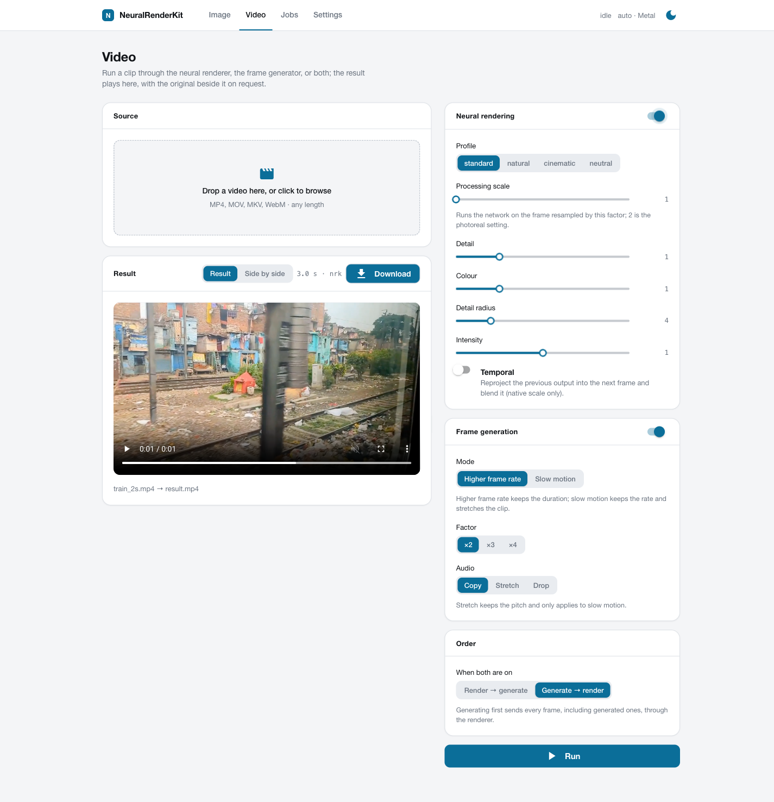
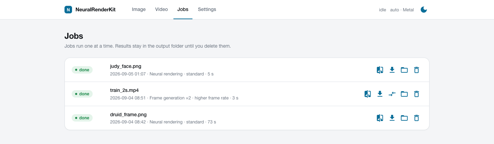

# MLX-DLSS

> [!TIP]
> **A note for the NVIDIA reader.** This port was worked out on a laptop and on
> GPU instances rented by the hour, some of which even booted. A pair of DGX
> Sparks would have replaced the rentals and would have a steady job here:
> experiments like this one, and the pet projects queued behind it. Hit me up on
> X: [@WaveCut](https://x.com/WaveCut).

Runtime for two networks recovered from NVIDIA's DLSS libraries: the
neural-rendering transformer (detail, colour, tone) and the frame generator
(interpolated frames for video). Swift package and `mlxdlss` CLI for Apple Silicon
(MLX/Metal, Core ML), Python package for every platform (PyTorch inference,
weight tooling, video conversion, web front end). Weights come from your own
copies of `nvngx_dlssnr.dll` and `libnvidia-ngx-dlssg.so`; nothing proprietary
is included, downloaded or redistributed.

MLX-DLSS is independent software, not affiliated with or endorsed by
NVIDIA, and not a drop-in implementation of DLSS.


Neural rendering on a 1408×1600 game render, 1:1 crop: input, defaults, `--processing-scale 2 --detail-strength 2`.

https://github.com/user-attachments/assets/ce94f426-910b-4556-bdf9-662cbdd5933a

Frame generation: even frames in, generated frames, the withheld odd frames (click for the video).

## Requirements

- Python 3.10+ (macOS, Linux, Windows); PyTorch is installed as a dependency.
- Video: `ffmpeg` and `ffprobe` in `PATH`; optical-flow temporal mode: `pip install './python[video]'`.
- Metal backend: macOS 14+, Xcode with Swift 6.2, CMake, Ninja.
- Core ML packages: `pip install './python[coreml]'` (macOS or Linux).
- Web front end: `pip install './python[web]'`.

## Weights

| network | source file | command | output |
| --- | --- | --- | --- |
| neural rendering | `nvngx_dlssnr.dll` (file version 310.8.0.0, SHA-256 `ceb6432f…2650`) | `mlxdlss-weights all nvngx_dlssnr.dll weights/ [--coreml 320x320]` | `weights/dlssnr-weights-logical.safetensors` (PyTorch), `weights/NeuralRendering.dlssmodel` (Metal), `weights/NeuralRendering-WxH-float16.mlpackage` (Core ML) |
| frame generation | `libnvidia-ngx-dlssg.so.310.7.0` (DLSS SDK 310.7.0) | `mlxdlss-weights extract-fg libnvidia-ngx-dlssg.so.310.7.0 weights/framegen.safetensors` | `weights/framegen.safetensors` (both backends) |

`mlxdlss-weights sha256 FILE` reports whether a DLL is a known checkpoint;
`mlxdlss-weights inspect PACKED` lists the tensors of an unknown version.

## Install and build

```sh
python -m pip install './python[web,video]'
swift build -c release && scripts/prepare-mlx-metallib.sh "$(swift build -c release --show-bin-path)"   # macOS, Metal backend
```

The second command is required after every clean Swift build: it places
`mlx.metallib` next to the `mlxdlss` binary.

## Commands

Still images:

```sh
mlxdlss-torch run --weights weights/dlssnr-weights-logical.safetensors --input in.png --output out.png   # PyTorch: --device auto|cpu|cuda|mps, --precision reference|fast
.build/release/mlxdlss render-image in.png weights/NeuralRendering.dlssmodel --output out.png --execution metal-fused --precision float16
.build/release/mlxdlss render-image in.png weights/NeuralRendering-320x320-float16.mlpackage --output out.png --backend coreml --compute-units cpu-gpu
```

Core ML packages have a fixed extent: a 256×256 image runs on the 320×320
package, 1080p needs 1920×1088. Raw float32 NHWC tensors:
`mlxdlss run MODEL --input in.f32 --input-format rgb-first-frame --width W --height H --output out.f32`,
`mlxdlss-torch run --input in.f32 --width W --height H`.

Frame generation:

```sh
.build/release/mlxdlss framegen a.png b.png --weights weights/framegen.safetensors --output between.png   # --factor 3|4 writes between-1.png …; --phase 0.25
mlxdlss-video framegen in.mp4 out.mp4 --weights weights/framegen.safetensors                       # frame rate x2, audio copied
mlxdlss-video framegen in.mp4 out.mp4 --weights weights/framegen.safetensors --backend mlxdlss         # Metal through mlxdlss framegen-stream; --batch 4 pairs per pass
mlxdlss-video framegen in.mp4 slow.mp4 --weights weights/framegen.safetensors --mode slowmo --factor 4 --audio stretch
```

`--mode fps` multiplies the frame rate and keeps the duration; `--mode slowmo`
keeps the rate and stretches the clip. `--audio copy|stretch|none`: `stretch`
(slow motion only) uses FFmpeg `atempo`, pitch preserved.

Video through the neural renderer:

```sh
mlxdlss-video convert in.mp4 out.mp4 --backend mlxdlss --model weights/NeuralRendering.dlssmodel --temporal --encode-args "-c:v libx265 -crf 20 -preset slow"
mlxdlss-video convert in.mp4 out.mp4 --weights weights/dlssnr-weights-logical.safetensors --device cuda --batch 4 --processing-scale 2 --detail-strength 2
mlxdlss-video convert in.mp4 clip.mp4 --weights ... --start-frame 300 --frames 120 --decode-args "-vf scale=1280:-2"
mlxdlss-video probe in.mp4
mlxdlss-video compare in.mp4 out.mp4          # original | processed side by side in mpv
```

`--temporal` reprojects the previous output with motion (OpenCV DIS optical
flow, or engine motion through the Python API) and blends it with the learned
history weight; `--scene-cut` resets the history on a luma jump. Default
encoding: `-c:v libx264 -crf 18 -preset medium -pix_fmt yuv420p -movflags +faststart`;
`--pix-fmt rgb48le` keeps 16-bit sources; `--status-interval` seconds between
progress lines. Temporal mode runs at the native scale.

Web front end:

```sh
mlxdlss-web        # http://127.0.0.1:8181; --port, --no-browser, --native (pywebview window), --root DIR
```

Pages: Image (before/after slider), Video (effect chain: neural rendering and
frame generation in either order; the result plays in place, a side-by-side
comparison with the original is one click away), Jobs (queue, progress,
cancel, downloads), Settings (weight paths, backend, device, theme). Jobs run
one at a time; results are stored under `~/MLX-DLSS/outputs/<job>/`.
HTTP API: `GET /api/effects`, `POST /api/jobs` (multipart `file` + JSON
`effects`), `GET /api/jobs[/{id}]`, `POST /api/jobs/{id}/cancel`,
`GET /api/jobs/{id}/output/{n}` (inline), `GET /api/jobs/{id}/download/{n}`,
`GET /api/jobs/{id}/preview` (side by side).

<p>
  <a href="docs/assets/web-image.png"></a>
  <a href="docs/assets/web-video.png"></a>
</p>
<p>
  <a href="docs/assets/web-jobs.png"></a>
</p>

Image: a 1280×1440 face crop rendered on Metal in 4.6 s at processing scale 2,
detail 2; drag the divider. Video: the converted clip plays in place, «Side by
side» shows it next to the original. Jobs: every result with its download,
the comparison clip and the folder.

## Controls (neural rendering)

| option (`mlxdlss run` / `mlxdlss-torch run` / `mlxdlss-video convert`) | default | effect |
| --- | --- | --- |
| `--profile standard\|natural\|cinematic\|neutral` | `standard` | style index and local tone/structure preset |
| `--processing-scale 1–4` | `1` | run the network on the frame resampled by this factor (memory and time grow with its square) |
| `--detail-strength 0–8`, `--colour-strength 0–4`, `--detail-radius` | `1`, `1`, `4` | `result = input + colour·lowpass(change) + detail·highpass(change)` |
| `--intensity 0–1` | `1` | blend of the enhanced result over the input |
| `--control-mask rgb.f32` | none | red: blend, green: tone, blue: structure, per pixel |
| `--noise-frame-index` | `0` | deterministic noise seed; sessions advance it per frame |

## Python API

```python
from mlxdlss import NeuralRenderingPipeline, TemporalSession, FrameGenerator
pipeline = NeuralRenderingPipeline.from_safetensors("weights/dlssnr-weights-logical.safetensors", device="auto")
result = pipeline.enhance(image_float32_hwc, profile="standard", processing_scale=2, detail_strength=2)
session = TemporalSession(pipeline)           # frame sequences; session.process(frame[, motion=engine_uv_offsets])
generator = FrameGenerator.from_safetensors("weights/framegen.safetensors", device="auto")
middle = generator.generate(frame_a_uint8, frame_b_uint8, factor=2)[0]   # factor-1 frames at phases k/factor
```

## Accuracy and speed

| component | measurement |
| --- | --- |
| Neural rendering, Metal | `0.004–0.005` MAE against the NVIDIA DLL on 1152–1408 px game renders |
| Neural rendering, PyTorch | within `0.002` MAE of the Metal port; ~8 s per 1440×1280 frame on an M2 Max (MPS, reference graph) |
| Neural rendering, memory | PyTorch: about `1 GB` per megapixel of network input at float32 (1080p `2.0 GB`, 2560×2880 `5.5 GB`), half of that with `--precision fast`; the graph is evaluated in bounded chunks, so the peak does not depend on window count (`MLXDLSS_TORCH_CHUNK_TOKENS` sets the chunk, `0` disables). Metal: `2.2 GB` resident for a 3840×2160 frame |
| Neural rendering, Core ML | `0.008–0.014` MAE against the DLL |
| Temporal path | Swift and Python agree within `0.0014` MAE per frame; against NVIDIA on a 64-frame static sequence: `0.0054` MAE (`42.3` dB) with the same drift from frame 0 as the vendor; motion, jitter and mask cases not captured |
| Frame generation | reproduces the library's output at `59.9` dB PSNR (max 3/255) on captured frames; five whole clips within `0.01–0.03` dB of the library (27.4–38.9 dB against withheld frames) |
| Frame generation, speed (M2 Max, 960×540 / 1920×1080) | Metal float16 `6.3 / 21` ms per frame on the GPU, `6.4 / 25` ms through `mlxdlss-video framegen --backend mlxdlss`; PyTorch/MPS float16 `5.3 / 17` ms |
| `mlxdlss stream` (video, Metal) | about 11 fps at 512×448 on an M2 Max end to end (ffmpeg, optical flow and the pipe included; features generated on the GPU), identical to `mlxdlss run-sequence` |

Not included: DLSS Super Resolution (measured, loses to Lanczos on realistic
content without engine motion vectors and jitter; see the note below) and the
frame generator's motion-vector, depth, HUD and inpainting inputs (no-ops for
plain video).

## Documentation

- [Frame generation](docs/frame-generation.md): the recovered graph, its verification against the library, whole-clip results, speed.
- [Super resolution](docs/super-resolution.md): what was measured and why it is not ported.
- [Embedding guide](docs/embedding.md): the Swift API for still frames, Core ML heads and the temporal reference.
- [Recovery notes](docs/recovery-notes.md): package format, the recovered neural-rendering graph, measured errors, temporal command-line reference.
- [Research notes](docs/research/): kernel captures and the first-frame preprocessor.

## Development

```sh
scripts/verify.sh                                                  # Swift tests, Python tests, public-tree audit
python -m unittest discover -s python -t python -p 'test_*.py'     # Python package tests only
SWIFTPM_MAXIMUM_CONCURRENT_JOBS=2 swift test                       # Swift tests only
scripts/audit-public-tree.sh .                                     # no DLLs, weights or captures in the tree
```

CI runs the Swift suite on macOS and the Python package on macOS, Linux and
Windows. The audit rejects executable binaries, CUDA fatbins, DLL and weight
files, large unreviewed files and absolute home paths; `weights/` and `.build/`
are ignored and must never be committed. See [SECURITY.md](SECURITY.md),
[CONTRIBUTING.md](CONTRIBUTING.md), [PUBLICATION.md](PUBLICATION.md) and
[NOTICE](NOTICE).

## License

Apache License 2.0 for the source. Model packages built from vendor libraries
keep the vendor's terms; do not redistribute them.
